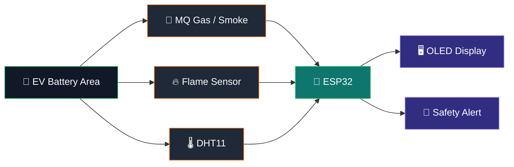

<!-- Animated GitHub README Header -->
<p align="center">
  
</p>

<p align="center">
  
</p>

<p align="center">
  
  
  
  
</p>

<p align="center">
  <a href="#-features">Features</a> •
  <a href="#-system-overview">Architecture</a> •
  <a href="#-getting-started">Setup</a> •
  <a href="#-testing--expected-behaviour">Testing</a> •
  <a href="#-future-improvements">Roadmap</a>
</p>

---

# 🔋 EV Battery Monitoring System for Fire Detection & Safety

An **ESP32-based safety monitoring system** designed to detect early signs of fire-related hazards around an EV battery system by continuously monitoring **gas/smoke, flame, temperature, and humidity**.

The system combines multiple sensors with an **OLED display** to provide immediate local feedback and trigger safety alerts when abnormal conditions are detected.

> ⚠️ **Note:** This project is a prototype/academic safety-monitoring system. It should not be treated as a certified EV Battery Management System (BMS) or as a replacement for automotive-grade battery protection hardware.

---

## ✨ Features

- 🔥 **Flame detection** using a flame sensor
- 💨 **Gas/smoke monitoring** using an MQ-series gas sensor
- 🌡️ **Temperature and humidity monitoring** using a DHT11 sensor
- 🖥️ **Real-time OLED display** for sensor readings and system status
- 🚨 **Hazard detection and alert logic** based on sensor conditions
- ⚡ **ESP32-based control**, providing a compact platform for real-time monitoring
- 🧩 Multiple sensors working together for more reliable fire-risk detection

---

## 🏗️ System Overview

### 🔄 Sensor → Decision → Alert pipeline



<details>
<summary><strong>⚡ Runtime sequence</strong></summary>

1. Sensors continuously capture the surrounding conditions.
2. The **ESP32** reads and evaluates the sensor values.
3. Normal readings are shown on the OLED.
4. Abnormal gas/smoke, flame, temperature, or humidity conditions are evaluated by the alert logic.
5. A hazard condition switches the system into its configured warning state.

</details>

### How it works

1. The **ESP32** continuously reads the connected sensors.
2. The **MQ gas/smoke sensor** checks for abnormal gas or smoke conditions.
3. The **flame sensor** checks for the presence of a flame.
4. The **DHT11** measures ambient temperature and humidity.
5. Sensor values are processed against the conditions defined in the firmware.
6. The **OLED display** presents the current readings/status locally.
7. When a hazardous condition is detected, the system enters an alert state and activates the configured safety indication.

---

## 📡 Live Monitoring Concept

<p align="center">
  
</p>

<p align="center">
  <b>SCAN → MEASURE → ANALYZE → DISPLAY → ALERT</b>
</p>

---

## 🧰 Hardware Requirements

| Component | Purpose |
|---|---|
| **ESP32** | Main microcontroller and sensor-processing unit |
| **MQ Gas/Smoke Sensor** | Detects gas/smoke-related changes |
| **Flame Sensor** | Detects flame/IR radiation |
| **DHT11** | Measures temperature and humidity |
| **0.96" OLED (SSD1306)** | Displays readings and system status |
| **Buzzer / alert indicator** | Provides local warning when configured |
| **Jumper wires & breadboard** | Circuit interconnection |
| **5V/USB power source** | Powers the prototype |

> Verify the voltage requirements of every module before connecting it to the ESP32. In particular, ensure that sensor outputs connected to ESP32 GPIO/ADC pins are within safe voltage levels.

---

## 💻 Software & Libraries

The firmware is written for the **ESP32 using the Arduino framework**.

### Main libraries used

```cpp
#include <Wire.h>
#include <Adafruit_GFX.h>
#include <Adafruit_SSD1306.h>
#include <DHT.h>
```

### Development environment

- Arduino IDE
- ESP32 board package
- Adafruit GFX Library
- Adafruit SSD1306 Library
- DHT sensor library

Install the required libraries through **Arduino IDE → Library Manager** before compiling the firmware.

---

## 🔌 Important Pin Configuration

The firmware currently defines the following sensor connections:

| Device | ESP32 Pin | Firmware Definition |
|---|---:|---|
| MQ gas/smoke sensor | GPIO 34 | `MQ_PIN` |
| Flame sensor digital output | GPIO 27 | `FLAME_DO` |
| DHT11 data | GPIO 4 | `DHTPIN` |
| OLED | I²C | `Wire` / I²C interface |

The OLED is configured for a **128 × 64** display using the SSD1306 driver.

> Check the source code in `Source code/Source-code.pdf` before wiring a fresh setup, especially for any additional alarm/indicator pins.

---

## 🚀 Getting Started

### 1. Clone the repository

```bash
git clone https://github.com/miriyalaterisha/Ev-battery-monitoring-system-for-fire-detection-and-safety.git
cd Ev-battery-monitoring-system-for-fire-detection-and-safety
```

### 2. Open the firmware

The source firmware is available in:

```text
Source code/Source-code.pdf
```

Copy the Arduino code into an `.ino` sketch in Arduino IDE.

### 3. Install dependencies

From Arduino IDE's Library Manager, install:

- Adafruit GFX Library
- Adafruit SSD1306
- DHT sensor library

Also make sure the **ESP32 board package** is installed.

### 4. Select the ESP32 board

In Arduino IDE:

```text
Tools → Board → ESP32 → Select your ESP32 board
```

Then select the correct COM/serial port.

### 5. Connect the hardware

Follow the wiring documentation available in:

```text
Circuit Connections and Working/
```

### 6. Upload the firmware

Connect the ESP32 through USB and upload the sketch.

### 7. Test each sensor

Test the system in a controlled environment:

- Expose the MQ sensor to a known gas/smoke source suitable for the sensor.
- Test the flame sensor with an appropriate test source.
- Verify temperature/humidity readings from the DHT11.
- Confirm that the OLED updates correctly.
- Verify that the alert state is triggered according to the configured thresholds.

---

## 📂 Repository Structure

```text
Ev-battery-monitoring-system-for-fire-detection-and-safety/
│
├── Circuit Connections and Working/
│   └── Circuit_Connections_and_Components.docx
│
├── Documentation/
│   └── Project documentation and supporting material
│
├── Project results/
│   └── output.docx
│
├── Source code/
│   └── Source-code.pdf
│
└── README.md
```

The repository currently contains **6 commits** and separates implementation, circuit documentation, project documentation, and results into dedicated folders.

---

## 🧪 Testing & Expected Behaviour

| Condition | Expected response |
|---|---|
| Normal environment | Sensor readings shown on OLED; system remains in normal state |
| Elevated gas/smoke level | Gas/smoke condition is detected and safety alert logic is evaluated |
| Flame detected | Flame condition is detected and alert state is triggered |
| Temperature/humidity changes | Updated DHT11 readings are shown on the OLED |
| Multiple abnormal conditions | Controller evaluates the combined sensor state and activates the configured warning behaviour |

Actual thresholds and alert behaviour are defined in the firmware and should be reviewed before deployment.

---

## 🎯 Project Objectives

- Provide an affordable prototype for **early hazard detection around EV battery systems**.
- Combine **multiple sensor inputs** instead of relying on a single fire indicator.
- Provide **immediate local visibility** of environmental conditions.
- Demonstrate how an ESP32 can be used for **real-time embedded safety monitoring**.
- Create a foundation that can be expanded into a more advanced EV battery safety platform.

---

## 🔮 Future Improvements

Potential extensions include:

- 📱 Mobile/app-based notifications
- ☁️ Cloud data logging and remote monitoring
- 📈 Historical sensor graphs and event logging
- 🔋 Direct battery voltage/current/SoC/SoH monitoring
- 🌡️ Multiple temperature sensors placed near battery cells/modules
- 🚗 CAN bus integration with an EV/BMS
- 🧠 Anomaly detection and predictive safety analytics
- 🛰️ GPS/location-aware emergency notifications
- 🔌 Automatic isolation of the battery pack through a properly engineered contactor/protection system
- 🧯 Integration with a certified suppression/safety subsystem

---

## 📚 Project Documentation

Additional project material is available in the repository:

- [Circuit Connections & Components](./Circuit%20Connections%20and%20Working/Circuit_Connections_and_Components.docx)
- [Source Code](./Source%20code/Source-code.pdf)
- [Project Results](./Project%20results/output.docx)
- [Documentation](./Documentation/)

---

## ⚠️ Safety Notice

This project is intended for **educational and prototype purposes**. EV lithium-ion battery packs can involve high voltage, high current, thermal runaway, toxic gases, fire, and explosion hazards.

Do not intentionally create unsafe battery, gas, or fire conditions during testing. Any real-world EV deployment requires automotive-grade sensing, isolation, protection, validation, fail-safe design, and compliance with applicable safety standards.

---

## ⭐ Project Snapshot

<p align="center">
  
  
  
  
</p>

---

## ⭐ Acknowledgement

Built as an embedded/IoT safety-monitoring project using **ESP32, gas/smoke sensing, flame detection, temperature/humidity monitoring, and OLED visualization**.

If this project is useful, consider ⭐ starring the repository.
